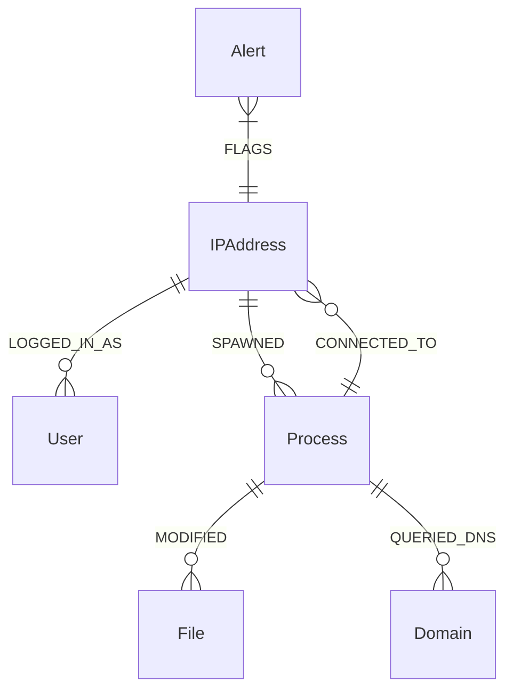

# 🏗️ Architecture & Detection Engineering: CyberTrace-Graph

CyberTrace-Graph implements a highly distributed, microservices-oriented architecture designed to handle large volumes of telemetry data for real-time Advanced Persistent Threat (APT) detection. 

Traditional Security Information and Event Management (SIEM) systems treat logs as flat, isolated strings, requiring analysts to manually correlate events using heavy SQL-like joins (e.g., SPL or KQL). CyberTrace-Graph fundamentally shifts this paradigm by mapping network telemetry into a **Property Graph Model**, exposing lateral movement, credential dumping, and complex, multi-stage attack patterns instantaneously.

---

## 1. The Data Pipeline (High-Throughput Streaming)

The pipeline is designed for high-availability and partition-tolerance, ensuring zero data loss during network segmentation.

### 1.1 Ingestion Tier (Junction Nodes)
Junction nodes act as distributed, lightweight edge sensors deployed across endpoints, cloud VPCs, and on-premise networks.
- **Resiliency (`collections.deque`):** Edge sensors utilize an in-memory ring-buffer. If the central Kafka broker drops, the sensor buffers telemetry locally. Upon reconnection, it automatically flushes the backlog, ensuring zero data loss.
- **Schema Enforcement:** All telemetry is strictly validated at the edge using Pydantic V2 models. Malformed logs are dropped before they pollute the message bus.

### 1.2 Event Backbone (Apache Kafka)
Kafka acts as the central nervous system. 
- **Partitioning Strategy:** Events are strictly partitioned by `source_ip`. This guarantees that the Python Stream Processor consumes events originating from the same host in absolute chronological order, which is a mathematical requirement for accurate sliding-window heuristics and behavioral ML models.

---

## 2. Detection Engineering (The Stream Processor)

The Python-based Stream Processor consumes raw events and runs them through a multi-layered detection funnel.

### 2.1 Machine Learning (Anomaly Detection)
We deploy Scikit-Learn **Isolation Forests** to detect zero-day Command & Control (C2) and exfiltration techniques that bypass signature-based tools.
- **DNS Tunneling & DGA (T1568 / T1071.004):** 
  - **Feature Vector:** `[unique_domains_queried, txt_query_ratio, nxdomain_ratio, max_subdomain_length]`
  - **Logic:** The model evaluates these features over a 5-minute tumbling window. High TXT query ratios coupled with long, high-entropy subdomains trigger a high-confidence alert for DNS Tunneling.

### 2.2 Statistical & Entropy Analysis
- **Ransomware Encryption (T1486):** 
  - **Logic:** Monitors `FILE_MODIFICATION` and `FILE_RENAME` events. The engine calculates the **Shannon Entropy** of the file extensions and payload metadata. An entropy spike (approaching 8.0) combined with a high volume of rename operations triggers an immediate critical alert, often catching ransomware before the encryption phase completes.

### 2.3 Heuristic Sliding Windows
- **OS Credential Dumping (T1003.001):** Monitors `PROCESS_CREATION` telemetry for known malicious binaries (e.g., `procdump`, `mimikatz`) and targeted memory access against `lsass.exe`.
- **Port Scanning (T1046):** Tracks distinct `destination_port` connections per `source_ip` over a 10-second sliding window. Breaching the threshold triggers an alert.
- **C2 Beaconing (T1132):** Calculates the Coefficient of Variation (CV) on connection intervals to external IP addresses. A CV < 0.1 indicates rigid, automated beaconing.

---

## 3. Graph Correlation (Neo4j)

The core innovation of CyberTrace-Graph is the correlation engine, which maps the MITRE ATT&CK framework directly into a Neo4j Property Graph.

### 3.1 The Graph Schema (Ontology)
Entities are mapped as Nodes, and actions are mapped as Edges (Relationships).



### 3.2 Advanced Threat Hunting (Cypher)

Because the data is graphed natively, Senior Analysts can execute complex threat hunts in milliseconds that would take minutes or hours in a standard SIEM.

**Example 1: Detecting Lateral Movement (Pass-the-Hash / RDP Hopping)**
Find an attacker who compromised a low-privilege workstation, dumped credentials, and used them to log into a critical server:
```cypher
MATCH path = (start:IPAddress)-[:LOGGED_IN_AS*2..5]->(target:IPAddress)
WHERE start.is_internal = true 
  AND target.is_critical = true
RETURN path
```

**Example 2: Identifying the Root Cause of a Ransomware Alert**
When a `RANSOMWARE` alert fires on a host, trace backward to find exactly which process initiated the encryption, and what external IP downloaded that payload:
```cypher
MATCH (a:Alert {type: "RANSOMWARE"})-[:FLAGS]->(infected:IPAddress)
MATCH (infected)-[:SPAWNED]->(p:Process)-[:MODIFIED]->(f:File)
MATCH (external:IPAddress)<-[:CONNECTED_TO]-(p)
RETURN external.ip, p.command_line, count(f) as encrypted_files
```

---

## 4. Security Architecture & Hardening

CyberTrace-Graph is built to defend itself.
- **API Authentication:** The FastAPI backend utilizes strict OAuth2 JSON Web Tokens (JWT). All REST endpoints and Server-Sent Event (SSE) streams require cryptographic Bearer token validation.
- **Network Isolation:** Internal persistence layers (Kafka, Neo4j, Redis, Zookeeper) are strictly bound to `127.0.0.1` and the internal Docker bridge network. They are physically inaccessible from external network adapters.
- **Zero Secrets Policy:** Hardcoded credentials are fundamentally rejected. Database passwords, JWT salts, and API keys are injected exclusively via `.env` configuration mapping.
