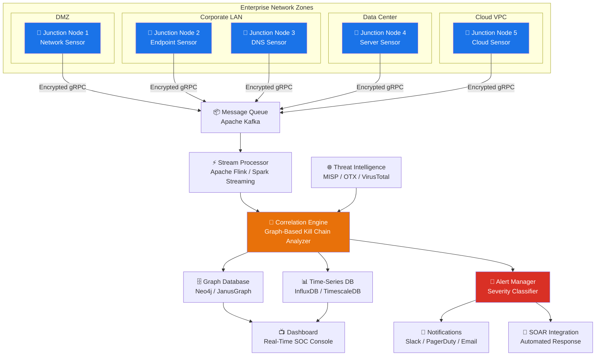
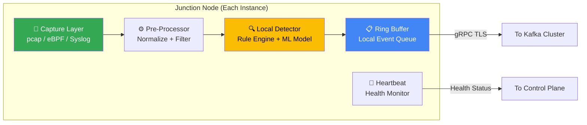
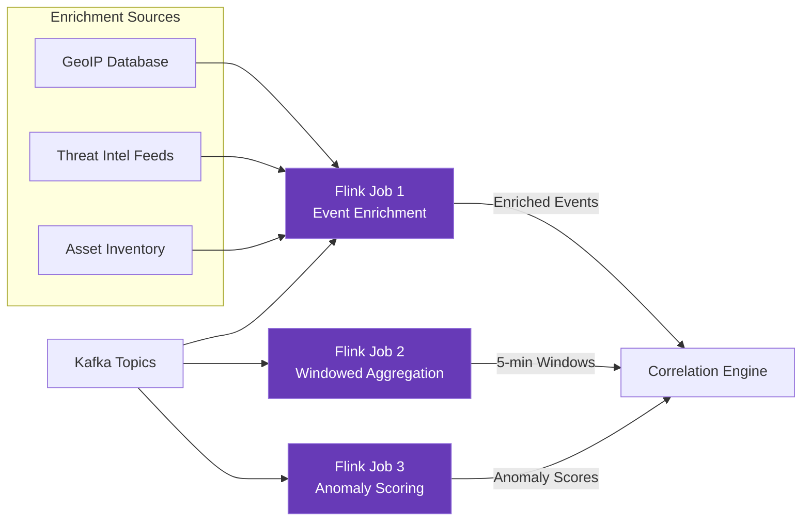
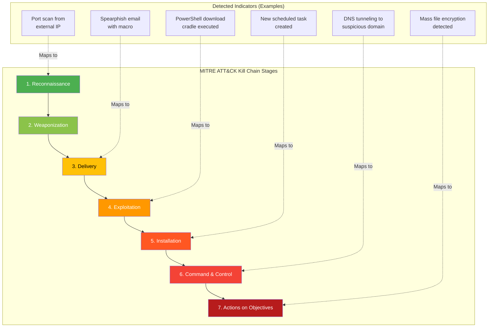
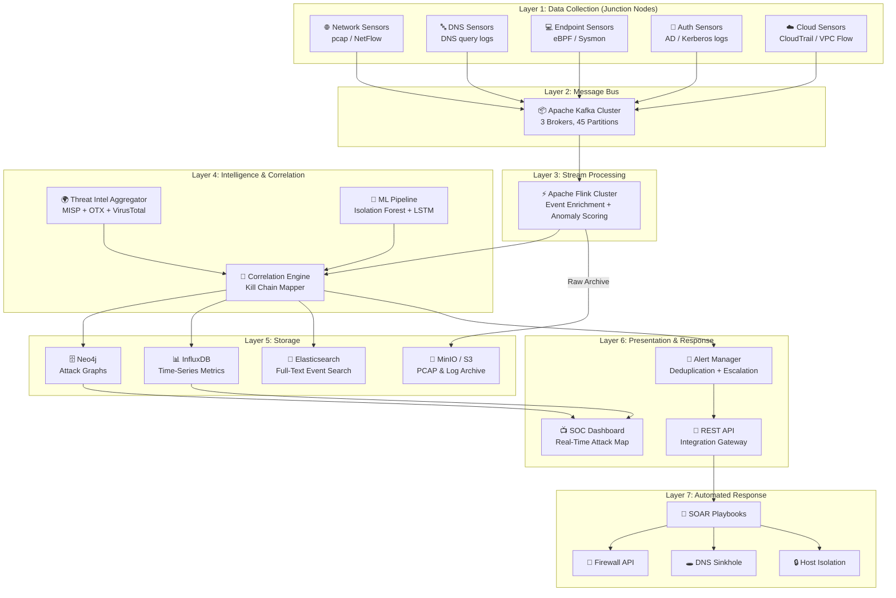
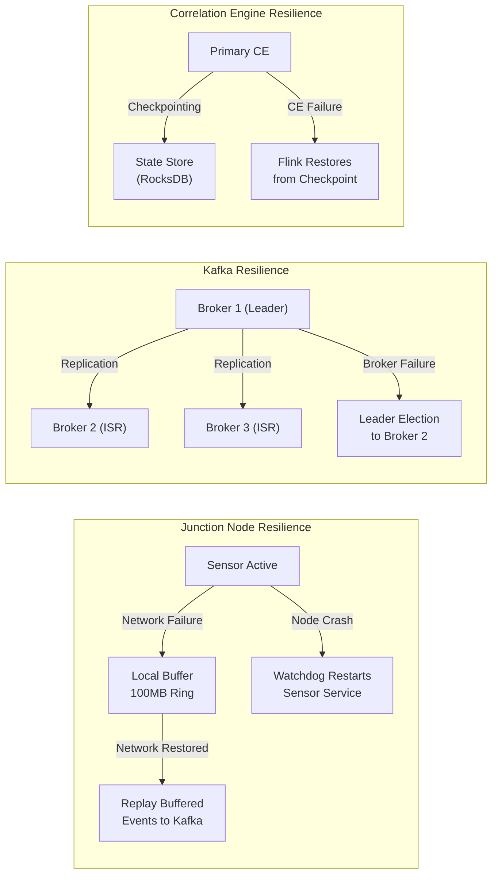

# CyberTrace-Graph — System Architecture with Distributed Junction Nodes

## Problem Statement

> **Advanced Persistent Threats (APTs) remain undetected for an average of 204 days** inside enterprise networks. Traditional security tools (firewalls, antivirus, basic SIEM) fail because APTs use **low-and-slow** tactics — DNS tunneling, periodic C2 beaconing, lateral movement via stolen credentials, and privilege escalation spread over weeks/months. No single network sensor can see the full picture.

**Project Goal:** Build a **CyberTrace-Graph** that deploys sensor nodes ("Junction Nodes") across an enterprise network to collectively detect, correlate, and visualize APT kill chain stages in real-time using graph-based threat analysis.

---

## 1. Why This Project Strengthens Your Profile

| Aspect | Impact |
|:---|:---|
| **Real-World Severity** | APTs cost enterprises $4.45M per breach (IBM 2024). You're solving a $Billion problem. |
| **Distributed Systems** | Demonstrates mastery of scalable, fault-tolerant architecture (per system-design-primer) |
| **Cybersecurity Depth** | Covers MITRE ATT&CK framework, kill chain analysis, threat intelligence |
| **AI/ML Integration** | Anomaly detection, behavioral analysis, time-series pattern recognition |
| **Data Engineering** | Real-time stream processing, graph databases, event-driven architecture |

---

## 2. System Overview — High-Level Architecture



---

## 3. Distributed Junction Nodes — Detailed Design

Junction Nodes are the **distributed sensor agents** deployed across the network. Each node is autonomous, lightweight, and capable of local pre-processing before forwarding enriched events to the central correlation engine.

### 3.1 Junction Node Architecture



### 3.2 Junction Node Types

| Node Type | Deployment Location | Data Captured | APT Indicators Detected |
|:---|:---|:---|:---|
| **Network Sensor** | Network TAP / SPAN port | Packet headers, NetFlow, connection metadata | Lateral movement, port scanning, unusual protocols |
| **DNS Sensor** | DNS resolver / forwarder | DNS queries & responses | DNS tunneling, DGA domains, C2 beaconing via DNS |
| **Endpoint Sensor** | Workstations / Servers | Process creation, file access, registry changes | Privilege escalation, persistence mechanisms, fileless malware |
| **Authentication Sensor** | Active Directory / LDAP | Login events, Kerberos tickets, NTLM hashes | Pass-the-hash, Kerberoasting, credential stuffing |
| **Cloud Sensor** | AWS/Azure/GCP VPC | API calls, security group changes, IAM events | Cloud credential abuse, resource hijacking |

### 3.3 Junction Node Communication Protocol

```
┌──────────────────────────────────────────────────────────┐
│              Junction Node Communication Protocol         │
├──────────────────────────────────────────────────────────┤
│                                                          │
│  ┌─────────┐    gRPC + mTLS     ┌────────────────┐      │
│  │ Junction │ ──────────────────▶│  Kafka Broker  │      │
│  │  Node    │    (Port 9443)     │  Cluster       │      │
│  └─────────┘                    └────────────────┘      │
│       │                                                  │
│       │  Heartbeat (every 30s)  ┌────────────────┐      │
│       └────────────────────────▶│ Control Plane  │      │
│          HTTP/2 + TLS            │ (Config Mgmt)  │      │
│                                 └────────────────┘      │
│                                                          │
│  Protocol: Protobuf-serialized events                    │
│  Auth: Mutual TLS (mTLS) with per-node certificates     │
│  Compression: LZ4 for bandwidth efficiency               │
│  Retry: Exponential backoff (1s, 2s, 4s, 8s, max 60s)  │
│  Buffer: 100MB local ring buffer for network partitions  │
│                                                          │
└──────────────────────────────────────────────────────────┘
```

---

## 4. Core Components — Detailed Design (System Design Primer Patterns)

### 4.1 Message Queue — Apache Kafka

Following the **Asynchronous Communication** pattern from the system-design-primer:

```
                    Kafka Cluster (3+ Brokers)
┌──────────────────────────────────────────────────────────┐
│                                                          │
│  Topic: apt.network.events     (Partitions: 12)         │
│  Topic: apt.dns.events         (Partitions: 6)          │
│  Topic: apt.endpoint.events    (Partitions: 12)         │
│  Topic: apt.auth.events        (Partitions: 6)          │
│  Topic: apt.cloud.events       (Partitions: 6)          │
│  Topic: apt.alerts.raw         (Partitions: 3)          │
│  Topic: apt.alerts.correlated  (Partitions: 3)          │
│                                                          │
│  Replication Factor: 3                                   │
│  Retention: 7 days (raw), 90 days (alerts)              │
│  Throughput Target: 100K events/sec                      │
│                                                          │
└──────────────────────────────────────────────────────────┘
```

> [!IMPORTANT]
> **Why Kafka?** Junction nodes produce events at wildly different rates. Kafka decouples producers (sensors) from consumers (analyzers), handles backpressure, and provides replay capability for incident investigation.

### 4.2 Stream Processing — Apache Flink

Applies the **Stream Processing** pattern for real-time event enrichment and windowed aggregation:



**Flink Jobs:**

| Job | Input | Processing | Output |
|:---|:---|:---|:---|
| **Event Enrichment** | Raw events from all sensors | GeoIP lookup, threat intel matching, asset context | Enriched events with risk metadata |
| **Windowed Aggregation** | All enriched events | Tumbling 5-min windows: count connections per host, DNS queries per domain, auth failures per user | Statistical summaries for baseline comparison |
| **Anomaly Scoring** | Enriched events + baselines | Isolation Forest ML model for detecting deviations from learned normal behavior | Per-event anomaly score (0.0 – 1.0) |

### 4.3 Correlation Engine — Graph-Based Kill Chain Analyzer

This is the **brain** of the system. It maps observed events to the **MITRE ATT&CK Kill Chain** and builds an attack graph.



**Correlation Rules Engine:**

```
┌────────────────────────────────────────────────────────────┐
│            Graph-Based Correlation Logic                    │
├────────────────────────────────────────────────────────────┤
│                                                            │
│  RULE: "Lateral Movement Chain"                            │
│  ──────────────────────────────                            │
│  IF:                                                       │
│    1. Failed auth attempts from Host_A → Host_B (>5/hr)   │
│    2. FOLLOWED BY successful login Host_A → Host_B         │
│    3. FOLLOWED BY new process on Host_B spawned by         │
│       the authenticated user                               │
│    4. FOLLOWED BY outbound connection from Host_B to       │
│       external IP not in whitelist                         │
│  WITHIN: 4-hour sliding window                             │
│  THEN:                                                     │
│    ► Create ATTACK_GRAPH edge: Host_A → Host_B             │
│    ► Stage: Lateral Movement (TA0008)                      │
│    ► Severity: HIGH                                        │
│    ► Confidence: (weighted by # of correlated events)      │
│                                                            │
│  RULE: "C2 Beaconing Detection"                            │
│  ──────────────────────────────                            │
│  IF:                                                       │
│    1. DNS/HTTP requests to same domain from Host_X         │
│    2. Requests exhibit periodic interval (jitter < 15%)    │
│    3. Domain age < 30 days OR uses DGA pattern             │
│    4. Payload size consistent (±10% variance)              │
│  WITHIN: 24-hour analysis window                           │
│  THEN:                                                     │
│    ► Create C2_CHANNEL node in attack graph                │
│    ► Stage: Command & Control (TA0011)                     │
│    ► Severity: CRITICAL                                    │
│    ► Auto-trigger: DNS sinkhole recommendation             │
│                                                            │
└────────────────────────────────────────────────────────────┘
```

### 4.4 Graph Database — Neo4j

Stores the **Attack Graph** — the interconnected web of hosts, users, processes, domains, and attack stages:

```
                        Attack Graph Schema
┌──────────────────────────────────────────────────────────┐
│                                                          │
│  Node Types:                                             │
│  ● Host       (ip, hostname, os, risk_score)             │
│  ● User       (username, domain, privilege_level)        │
│  ● Process    (pid, name, hash, parent_pid)              │
│  ● Domain     (fqdn, registrar, age, reputation)         │
│  ● File       (path, hash_sha256, entropy)               │
│  ● Alert      (id, severity, mitre_tactic, confidence)   │
│                                                          │
│  Edge Types:                                             │
│  → CONNECTED_TO    (Host → Host, with port & protocol)   │
│  → AUTHENTICATED   (User → Host, with method & time)     │
│  → EXECUTED        (User → Process, on Host)             │
│  → RESOLVED        (Host → Domain, via DNS query)        │
│  → ACCESSED        (Process → File, with operation)      │
│  → TRIGGERED       (Event → Alert, with evidence)        │
│  → LATERAL_MOVE    (Host → Host, attack progression)     │
│  → EXFILTRATED_TO  (Host → Domain, data theft)           │
│                                                          │
└──────────────────────────────────────────────────────────┘
```

**Example Cypher Query — Find Complete Attack Chains:**
```cypher
// Find all hosts involved in a multi-stage attack
MATCH path = (entry:Host)-[:LATERAL_MOVE*1..5]->(target:Host)
WHERE entry.external_facing = true
AND target.contains_sensitive_data = true
RETURN path, 
       [n IN nodes(path) | n.hostname] AS compromised_hosts,
       length(path) AS attack_depth
ORDER BY attack_depth DESC
```

---

## 5. System Architecture — Full Component Diagram



---

## 6. Scalability & Reliability (System Design Primer Patterns Applied)

### 6.1 Patterns Used

| Pattern | Application | Reference |
|:---|:---|:---|
| **Horizontal Scaling** | Add more Junction Nodes as network grows. Kafka partitions auto-balance load. | [system-design-primer: Scalability](https://github.com/donnemartin/system-design-primer#scalability) |
| **Asynchronous Messaging** | Kafka decouples sensors from processors. No direct dependency. | [system-design-primer: Asynchronism](https://github.com/donnemartin/system-design-primer#asynchronism) |
| **Database Sharding** | Elasticsearch shards events by time (daily indices). Neo4j federated across zones. | [system-design-primer: Sharding](https://github.com/donnemartin/system-design-primer#sharding) |
| **Caching** | Redis caches threat intel lookups (TTL: 1hr), GeoIP results, and asset metadata. | [system-design-primer: Cache](https://github.com/donnemartin/system-design-primer#cache) |
| **Load Balancing** | Kafka consumer groups distribute Flink processing. API load balanced via NGINX. | [system-design-primer: Load Balancer](https://github.com/donnemartin/system-design-primer#load-balancer) |
| **Redundancy** | Kafka replication factor 3. Neo4j causal cluster. Multi-AZ deployment. | [system-design-primer: Availability](https://github.com/donnemartin/system-design-primer#availability-in-numbers) |
| **CAP Theorem** | System favors **AP** (Availability + Partition tolerance). Events must flow even during network partitions. Eventual consistency acceptable for attack graphs. | [system-design-primer: CAP Theorem](https://github.com/donnemartin/system-design-primer#cap-theorem) |

### 6.2 Back-of-the-Envelope Calculations

```
Enterprise with 10,000 endpoints:
├── Network events:    ~50,000 events/sec (NetFlow + packet metadata)
├── DNS events:        ~5,000 queries/sec
├── Endpoint events:   ~10,000 events/sec (process + file + registry)
├── Auth events:       ~1,000 events/sec  
├── Cloud events:      ~500 events/sec
└── TOTAL:             ~66,500 events/sec → ~5.7B events/day

Storage (per day):
├── Raw events (avg 500 bytes):  ~2.85 TB/day
├── Enriched events:             ~4.2 TB/day  
├── Attack graph (Neo4j):        ~50 GB/day (nodes + edges)
├── Time-series metrics:         ~100 GB/day
└── TOTAL:                       ~7.2 TB/day → ~2.6 PB/year

Latency Targets:
├── Junction Node → Kafka:       < 100ms (P99)
├── Kafka → Flink processing:    < 500ms (P99)
├── Correlation + Alert:         < 2 sec (P99)
└── End-to-end detection:        < 5 sec (P99)
```

### 6.3 Fault Tolerance Design



---

## 7. Security of the System Itself

> [!CAUTION]
> A security monitoring system is itself a **high-value target**. If attackers compromise the APT Hunter, they can blind the defenders.

| Threat | Mitigation |
|:---|:---|
| **Junction Node Compromise** | mTLS certificates per node. Node attestation via TPM. Anomaly detection on node behavior itself. |
| **Event Tampering** | Cryptographic event signing at source (Ed25519). Merkle tree integrity verification. |
| **Kafka Poisoning** | Schema validation (Avro/Protobuf). Input sanitization. Rate limiting per producer. |
| **Insider Threat** | Role-based access (RBAC) for dashboard. Audit log on all analyst queries. Separation of duties. |
| **Supply Chain** | SBOM for all components. Container image signing (Cosign). Dependency scanning. |

---

## 8. Technology Stack Summary

| Layer | Technology | Justification |
|:---|:---|:---|
| **Junction Node Agent** | Python + eBPF (Linux) / Sysmon (Windows) | Lightweight, cross-platform sensor |
| **Message Queue** | Apache Kafka | Industry standard for high-throughput event streaming |
| **Stream Processing** | Apache Flink | Exactly-once semantics, windowed processing, ML model serving |
| **Correlation Engine** | Python/Go custom service | Graph algorithm performance + threat intel integration |
| **Graph Database** | Neo4j Community Edition | Native graph storage, Cypher query language for attack path analysis |
| **Time-Series DB** | InfluxDB | Optimized for metrics aggregation and anomaly baseline queries |
| **Search** | Elasticsearch + Kibana | Full-text search over raw events for incident investigation |
| **Cache** | Redis | Sub-ms threat intel and GeoIP lookups |
| **ML Framework** | scikit-learn + PyTorch | Isolation Forest (anomaly), LSTM (beaconing detection) |
| **Dashboard** | React + D3.js | Interactive attack graph visualization + real-time SOC console |
| **Containerization** | Docker + Kubernetes | Orchestration of all services, auto-scaling Flink jobs |
| **IaC** | Terraform + Helm Charts | Reproducible deployment across environments |

---

## 9. Deployment Architecture

```mermaid
graph TB
    subgraph "Kubernetes Cluster"
        subgraph "Namespace: apt-hunter-data"
            KF1["Kafka Broker 1"]
            KF2["Kafka Broker 2"]
            KF3["Kafka Broker 3"]
            ZK["Zookeeper Ensemble"]
        end
        
        subgraph "Namespace: apt-hunter-processing"
            FL["Flink JobManager"]
            FW1["Flink TaskManager 1"]
            FW2["Flink TaskManager 2"]
            FW3["Flink TaskManager 3"]
        end

        subgraph "Namespace: apt-hunter-storage"
            N4J["Neo4j Cluster"]
            IDB["InfluxDB"]
            ES["Elasticsearch Cluster"]
            RDS["Redis Sentinel"]
        end

        subgraph "Namespace: apt-hunter-app"
            API_SVC["API Service (3 replicas)"]
            CE_SVC["Correlation Engine (2 replicas)"]
            DASH_SVC["Dashboard (2 replicas)"]
            ALERT_SVC["Alert Manager"]
        end
    end

    subgraph "External"
        LB["☁️ Load Balancer<br/>(NGINX Ingress)"]
        MON["📊 Monitoring<br/>Prometheus + Grafana"]
    end

    LB --> API_SVC & DASH_SVC
    MON --> KF1 & FL & N4J & ES
```



---

## 10. Project Implementation Phases

### Phase 1: Foundation (Weeks 1–2)
- [ ] Set up Kafka cluster (Docker Compose for dev)
- [ ] Build 1 Junction Node type (DNS Sensor)
- [ ] Implement basic event schema (Protobuf)
- [ ] Create Kafka producer in Junction Node

### Phase 2: Processing Pipeline (Weeks 3–4)
- [ ] Set up Flink for stream processing
- [ ] Implement event enrichment (GeoIP, asset lookup)
- [ ] Build windowed aggregation jobs
- [ ] Integrate threat intelligence feeds (OTX free tier)

### Phase 3: Correlation Engine (Weeks 5–6)
- [ ] Set up Neo4j and define attack graph schema
- [ ] Implement MITRE ATT&CK mapping rules
- [ ] Build C2 beaconing detector (periodicity analysis)
- [ ] Build lateral movement chain detector

### Phase 4: Detection & ML (Weeks 7–8)
- [ ] Train Isolation Forest on normal network baselines
- [ ] Implement DNS tunneling detector (entropy + frequency analysis)
- [ ] Build DGA domain classifier
- [ ] Integrate ML anomaly scores into correlation engine

### Phase 5: Dashboard & Response (Weeks 9–10)
- [ ] Build React SOC dashboard with D3.js attack graph visualization
- [ ] Real-time alert feed with severity classification
- [ ] Implement SOAR playbook stubs (auto-block, DNS sinkhole)
- [ ] API for third-party integration

### Phase 6: Hardening & Demo (Weeks 11–12)
- [ ] Add mTLS between all components
- [ ] Kubernetes deployment with Helm charts
- [ ] Performance testing and tuning
- [ ] Create attack simulation dataset for demo
- [ ] Documentation and README

---

## 11. Demo Attack Scenario (For Portfolio Showcase)

To demonstrate the system, simulate a **realistic APT attack chain**:

```
Timeline:
T+0h    → External port scan of DMZ host (Reconnaissance)
T+2h    → Spearphish email delivered with malicious attachment (Delivery)  
T+2.5h  → Macro executes PowerShell download cradle (Exploitation)
T+3h    → Scheduled task created for persistence (Installation)
T+4h    → DNS tunneling C2 channel established (Command & Control)
T+6h    → Credential dumping with Mimikatz (Credential Access)
T+8h    → Lateral movement to file server via Pass-the-Hash (Lateral Movement)
T+12h   → Sensitive documents staged and exfiltrated via HTTPS (Exfiltration)

Expected System Response:
T+0h    → Junction Node 1 flags port scan → LOW alert
T+2.5h  → Junction Node 2 flags suspicious PowerShell → MEDIUM alert  
T+3h    → Correlation Engine links scan + PowerShell → escalate to HIGH
T+4h    → Junction Node 3 detects DNS beaconing → CRITICAL C2 alert
T+6h    → Full kill chain mapped → SOC dashboard shows attack graph
T+6.1h  → Automated response: DNS sinkhole C2 domain + isolate host
```

---

## Open Questions

> [!IMPORTANT]
> **Q1:** Do you want me to build a **working prototype** of this system (with Docker Compose, simulated data, and a web dashboard)? Or is this architecture document sufficient for your mini-project submission?

> [!IMPORTANT]
> **Q2:** What is your preferred tech stack familiarity? (Python / Java / Go — this affects the Junction Node and Correlation Engine language choice)

> [!IMPORTANT]  
> **Q3:** Should I also generate a **PowerPoint-style presentation** of this architecture for your project viva/review?
