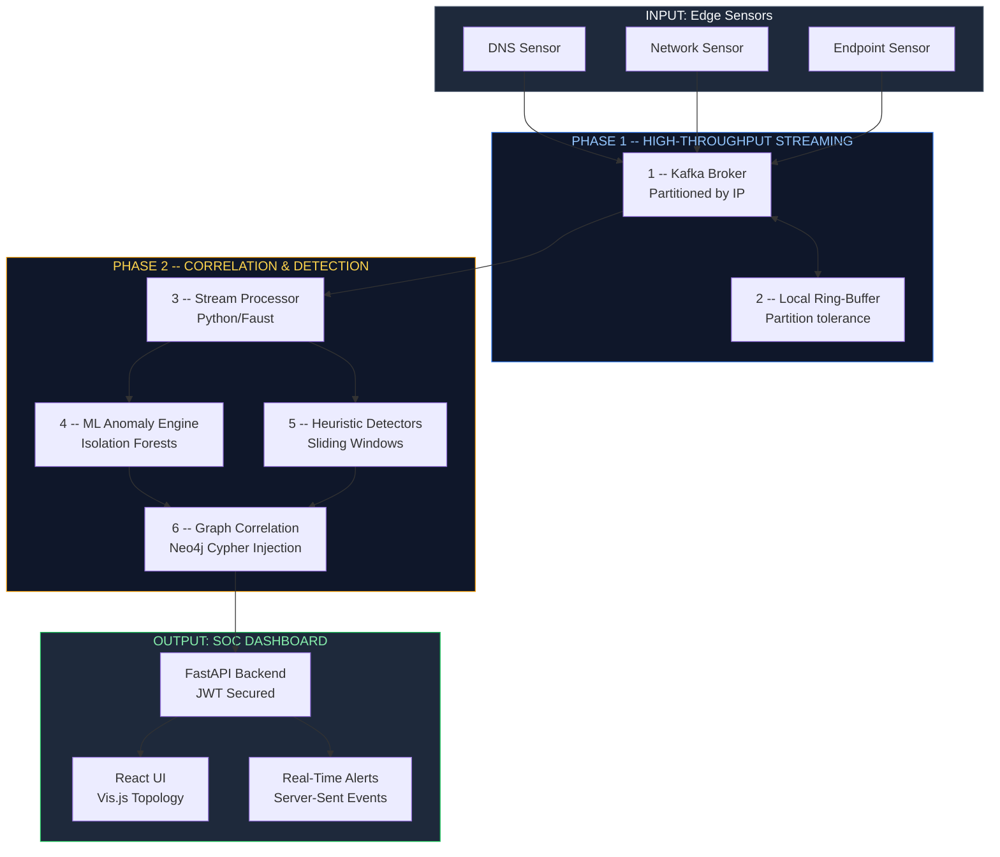

<div align="center">

# CyberTrace-Graph

**Industry-Grade Distributed SIEM & XDR Threat Hunting Platform**

Real-time telemetry ingestion, machine-learning anomaly detection, and graph-based correlation. Detect advanced persistent threats (APTs) and lateral movement as they happen.

[](https://www.python.org/)
[](LICENSE)
[](https://www.docker.com/)
[](https://reactjs.org/)
[](https://fastapi.tiangolo.com/)
[](https://neo4j.com/)
[](https://kafka.apache.org/)

---

> *"Standard SIEMs treat logs as flat text. CyberTrace-Graph treats your network as a highly connected battlefield, automatically mapping out lateral movement and multi-stage attacks."*

</div>

---

## The Problem

Modern SOCs are drowning in alert fatigue. Legacy Security Information and Event Management (SIEM) tools struggle because they evaluate events in isolation. They are blind to:

- **Lateral Movement:** An attacker using stolen credentials to hop between internal machines.
- **Low and Slow Beaconing:** Command and Control (C2) traffic that blends in with normal network noise over days.
- **Multi-Stage APTs:** The connection between a phishing email (Initial Access) and a massive database dump (Exfiltration) a week later.

CyberTrace-Graph was built to close that gap by unifying streaming analytics with graph database technology.

---

## How It Works

The platform runs incoming telemetry through a sophisticated pipeline, transforming raw logs into a connected graph of malicious behavior.



---

## Pipeline Stages

### Phase 1: High-Throughput Streaming

| Stage | Name | Description |
|:-----:|------|-------------|
| **1** | **Kafka Backbone** | All telemetry is streamed through Apache Kafka. Events are partitioned by source IP address to guarantee ordered processing for stateful windowed analytics. |
| **2** | **Resilient Edge Nodes** | Python-based junction nodes deployed on edge devices use a local `collections.deque` ring-buffer to survive network partitions, automatically flushing to Kafka upon reconnection. |

### Phase 2: Correlation & Detection

| Stage | Name | Description |
|:-----:|------|-------------|
| **3** | **Graph DB Ingestion** | Uses Neo4j to store relational mappings. IPs, Domains, Users, and Processes are mapped as nodes. Edges represent interactions (`USER -> LOGGED_IN_TO -> HOST`). |
| **4** | **ML Anomaly Engine** | Deploys Scikit-Learn **Isolation Forests** to detect Domain Generation Algorithms (DGA) and DNS Tunneling by evaluating TXT query ratios and unique domain counts in real-time. |
| **5** | **Heuristic Engine** | Detects rapid Port Scans (T1046) and OS Credential Dumping via LSASS (T1003.001) using sliding time windows and command-line keyword matching. |
| **6** | **Ransomware Detection** | Evaluates file extensions and calculates **Shannon Entropy** spikes in file systems to detect active ransomware encryption (T1486) before critical data is lost. |

---

## Comparison with Industry Tools

> CyberTrace-Graph provides the graph-based lateral movement detection of advanced XDRs with the streaming capabilities of modern SIEMs.

| Capability | CyberTrace-Graph | Splunk Enterprise | Microsoft Sentinel | CrowdStrike Falcon |
|:-----------|:---------------------:|:-----:|:----:|:----------:|
| Real-Time Event Streaming | Yes | Yes | Yes | Yes |
| Native Graph Database (Neo4j) | **Yes** | No | No | Yes (Threat Graph) |
| Built-in ML Anomaly Detection | **Yes** | Paid Add-on | Yes | Yes |
| Visual Attack Path Topology | **Yes** | Requires App | Partial | Yes |
| Edge Node Partition Tolerance | **Yes** | No | No | Yes |
| Built-in Adversary Simulator | **Yes** | No | No | No |
| Shannon Entropy Ransomware Checks | **Yes** | No | Custom Queries | Yes |
| Free / Open Source | **Yes** | Enterprise Pricing | Pay-as-you-go | Enterprise Pricing |

---

## 🛡️ Military-Grade Security Architecture

Unlike many open-source prototypes, CyberTrace-Graph secures its own infrastructure:
- **Zero Hardcoded Secrets:** All credentials (Neo4j, JWT salts) are strictly injected via `.env`.
- **Network Isolation:** Internal data stores (Kafka, Neo4j, Redis, Zookeeper) are strictly bound to `127.0.0.1` and the internal Docker bridge network. They are invisible to external network adapters.
- **Cryptographic Auth:** The FastAPI backend utilizes OAuth2 with JWT (JSON Web Tokens). All API endpoints and Server-Sent Event (SSE) streams require strict Bearer token validation.

---

## 🚀 Quick Start

### Prerequisites
- Docker and Docker Compose
- Python 3.11+
- Node.js (for Dashboard)

### 1. Initialize Configuration
```bash
cp .env.example .env
# Edit .env with your secure passwords!
```

### 2. Start the Secure Infrastructure
```bash
docker-compose up -d
```

### 3. Launch the Stream Processor
```bash
# Windows
$env:PYTHONPATH="."
$env:PYTHONUTF8="1"
python -m junction_nodes.stream_processor.main
```

### 4. Start the SOC Dashboard
```bash
# Terminal 1: Backend API
python -m uvicorn dashboard.api.main:app --reload --port 8000

# Terminal 2: React Frontend
cd dashboard/frontend
npm install
npm run dev
```

### 5. Run an Attack Simulation
```bash
# Test the ML and Heuristic engines!
python -m attack_simulator.simulate_apt ransomware --output kafka
python -m attack_simulator.simulate_apt cred-dump --output kafka
python -m attack_simulator.simulate_apt port-scan --output kafka
```

## 📜 License
This project is licensed under the MIT License - see the [LICENSE](LICENSE) file for details.
